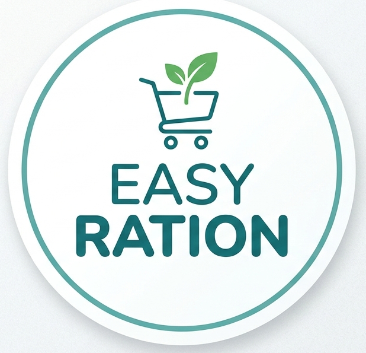

<div align="center">



# 🌾 Easy-Ration

### AI-Powered Smart Ration Slot Booking System

<p align="center">
  <a href="https://e-ration-eight.vercel.app/" target="_blank">
    
  </a>
</p>

<p align="center">
  
  
  
  
  
  
</p>

<p align="center">
  
  
  
  
</p>

<br/>

> **Transforming India's Public Distribution System** — A secure, bilingual, AI-powered platform that lets PDS beneficiaries book ration collection time slots, verify identity via live face authentication, and receive a digital QR-coded ticket — all from any smartphone browser.

<br/>

[](https://e-ration-eight.vercel.app/)

</div>

---

## 📋 Table of Contents

- [✨ Features](#-features)
- [🖼️ Screenshots](#️-screenshots)
- [🏗️ Architecture](#️-architecture)
- [⚙️ Tech Stack](#️-tech-stack)
- [🔌 API Reference](#-api-reference)
- [🗃️ Database Schema](#️-database-schema)
- [🌐 Deployment](#-deployment)
- [🔮 Future Roadmap](#-future-roadmap)


---

## ✨ Features

<table>
<tr>
<td width="50%">

### 🔐 Security & Identity
- **AI Face Authentication** with animated liveness detection (blink check)
- **Photo-spoofing prevention** via real-time webcam capture
- **SHA-256 QR token** generation for tamper-proof tickets
- **One booking per ID per date** enforced at both DB and frontend level

</td>
<td width="50%">

### 📱 Accessibility & UX
- **Bilingual interface** — English & हिंदी with one-click switching
- **AI Voice Assistant** guides users step-by-step (Web Speech API)
- **Mobile-first design** — works on any smartphone browser, no install needed
- **Mute/unmute toggle** for voice guidance

</td>
</tr>
<tr>
<td width="50%">

### 📅 Slot Management
- **8 time slots/day** — 9AM–1PM and 3PM–7PM in 1-hour intervals
- **Real-time availability** progress bars per slot
- **Capacity management** — slots auto-disable when full (max 5/slot, scalable to 20)
- **4-day date picker** with live availability preview

</td>
<td width="50%">

### 🎟️ Booking & Verification
- **Instant QR-coded ticket** on successful booking
- **Unique reference numbers** in `RJxxxxx` format
- **Booking status lookup** by Consumer ID
- **One-click cancellation** from the status screen

</td>
</tr>
</table>

---

## 🖼️ Screenshots

<div align="center">

| Language Selection | Home Screen | Slot Booking |
|:---:|:---:|:---:|
| Select EN or हिंदी on launch | Book slot or check status | Real-time slot availability |

| Face Authentication | QR Ticket | Booking Status |
|:---:|:---:|:---:|
| Live liveness detection | Scannable QR confirmation | View & cancel bookings |

> 📸 *Live screenshots available at [e-ration-eight.vercel.app](https://e-ration-eight.vercel.app/)*

</div>

---

## 🏗️ Architecture

```
┌─────────────────────────────────────────────────────────────────┐
│                        CLIENT (Browser)                          │
│                                                                  │
│  ┌──────────────┐  ┌─────────────────┐  ┌──────────────────┐   │
│  │ Language     │  │  BookingFlow    │  │   StatusFlow     │   │
│  │ Selector     │→ │  (5-step flow)  │  │  (lookup/cancel) │   │
│  └──────────────┘  └────────┬────────┘  └──────────────────┘   │
│                              │                                   │
│                   ┌──────────▼──────────┐                       │
│                   │   FaceScanner       │  ← Web Speech API     │
│                   │   (Liveness KYC)    │  ← navigator.camera   │
│                   └──────────┬──────────┘                       │
│                              │                                   │
│                   ┌──────────▼──────────┐                       │
│                   │    QRTicket         │  ← qrcode.react       │
│                   └─────────────────────┘                       │
└──────────────────────────┬──────────────────────────────────────┘
                           │ REST API (Next.js API Routes)
┌──────────────────────────▼──────────────────────────────────────┐
│                        SERVER (Next.js)                          │
│                                                                  │
│  POST /api/book      GET /api/slots      GET /api/customer/[id] │
│  GET  /api/booking   DELETE /api/booking GET /api/seed           │
└──────────────────────────┬──────────────────────────────────────┘
                           │ Mongoose ODM
┌──────────────────────────▼──────────────────────────────────────┐
│                     DATABASE (MongoDB Atlas)                     │
│                                                                  │
│   customers collection          bookings collection             │
│   ┌─────────────────────┐       ┌────────────────────────────┐  │
│   │ customerId (unique) │       │ customerId + date (unique) │  │
│   │ members[]           │       │ memberName, timeSlot       │  │
│   │  - name, age        │       │ referenceNumber, qrToken   │  │
│   │  - faceDescriptor[] │       │ status, createdAt          │  │
│   └─────────────────────┘       └────────────────────────────┘  │
└─────────────────────────────────────────────────────────────────┘
```

---

## ⚙️ Tech Stack

| Layer | Technology | Purpose |
|-------|-----------|---------|
| **Frontend** | Next.js 14 (React) | SSR/CSR hybrid web app |
| **Language** | TypeScript | Type-safe development |
| **Styling** | Tailwind CSS v3 | Utility-first responsive design |
| **Animation** | Framer Motion | Page transitions & micro-interactions |
| **Database** | MongoDB Atlas | Cloud NoSQL document storage |
| **ODM** | Mongoose | Schema validation & queries |
| **QR Code** | qrcode.react | SVG QR code generation |
| **Face Auth** | Browser Webcam + face-api.js | Live biometric capture & matching |
| **Voice** | Web Speech API | AI voice guidance (SpeechSynthesis) |
| **Deployment** | Vercel | Serverless Next.js hosting |
| **Version Control** | Git / GitHub | Source code management |

---

## 🔌 API Reference

### `POST /api/book`
Create a new booking slot.

**Request Body:**
```json
{
  "customerId": "12001",
  "memberName": "Rahul Sharma",
  "date": "2025-07-15",
  "timeSlot": "09:00 AM - 10:00 AM"
}
```

**Response (200):**
```json
{
  "success": true,
  "booking": {
    "customerId": "12001",
    "memberName": "Rahul Sharma",
    "date": "2025-07-15",
    "timeSlot": "09:00 AM - 10:00 AM",
    "referenceNumber": "RJ58432",
    "qrToken": "a3f9c2...",
    "status": "BOOKED"
  }
}
```

---

### `GET /api/slots?date=YYYY-MM-DD`
Get real-time slot availability for a given date.

**Response:**
```json
{
  "success": true,
  "slots": [
    {
      "timeSlot": "09:00 AM - 10:00 AM",
      "booked": 3,
      "maxCapacity": 5,
      "isFull": false
    }
  ]
}
```

---

### `GET /api/customer/[id]`
Fetch customer details and family member list by Consumer ID.

---

### `GET /api/booking/[customerId]`
Retrieve the most recent booking for a Customer ID.

---

### `DELETE /api/booking/[customerId]`
Cancel the most recent booking for a Customer ID.

---

### `GET /api/seed`
Populate the database with 10 sample consumer records (development only).

---

## 🗃️ Database Schema

### `Customer`
```typescript
{
  customerId: String,       // e.g., "12001" (unique)
  members: [{
    name: String,           // e.g., "Rahul Sharma"
    age: Number,
    faceDescriptor: [Number] // 128D face vector (production)
  }]
}
```

### `Booking`
```typescript
{
  customerId: String,       // Linked consumer ID
  memberName: String,       // Who is collecting
  date: String,             // "YYYY-MM-DD"
  timeSlot: String,         // "09:00 AM - 10:00 AM"
  referenceNumber: String,  // "RJxxxxx" (unique)
  qrToken: String,          // SHA-256 hash token
  status: String,           // "BOOKED"
  createdAt: Date
  // Compound unique index: { customerId, date }
}
```

---

## 🌐 Deployment

This project is deployed on **Vercel** with zero configuration.

### 🔗 Live App

> **[https://e-ration-eight.vercel.app/](https://e-ration-eight.vercel.app/)**

### Deploy Your Own Fork

[](https://vercel.com/new/clone?repository-url=https://github.com/iampiyushchouhan/E-Ration)

1. Click **Deploy with Vercel** above
2. Connect your GitHub account
3. Add the following environment variables in the Vercel dashboard:
   - `MONGODB_URI` — your MongoDB Atlas connection string
   - `NEXT_PUBLIC_APP_URL` — your Vercel deployment URL
4. Click **Deploy** — that's it!

---

## 🔮 Future Roadmap

| Feature | Status | Description |
|---------|--------|-------------|
| 🧠 Production Face Recognition | 🔜 Planned | Real 128D face-api.js matching vs. stored descriptors |
| 🪪 Aadhaar eKYC Integration | 🔜 Planned | Link with UIDAI API for national biometric verification |
| 🏪 Shop Scanner Dashboard | 🔜 Planned | Admin panel for dealers to mark QR as collected |
| 🔔 Push Notifications | 🔜 Planned | Firebase FCM reminders for slot time |
| 📶 Offline / PWA Mode | 🔜 Planned | Service worker for ticket viewing without internet |
| 📊 Government Analytics Dashboard | 🔜 Planned | State-level distribution tracking & anomaly detection |
| 🌍 Multi-Language Support | 🔜 Planned | Gujarati, Marathi, Tamil, Telugu, Bengali |
| 📞 IVRS Integration | 🔜 Planned | Slot booking via phone call for non-smartphone users |

---

## 👨‍💻 Authors

<table>
<tr>
<td align="center" width="50%">
<br/>
<b>Piyush Chouhan</b><br/>

B.Tech CSE (AIML)<br/>
JIET Institute of Design & Technology<br/>
<br/>
<b>Contributions:</b><br/>
Backend APIs · MongoDB Schema · Seed Data<br/>
Face Authentication · QR Ticket · Voice API
</td>
<td align="center" width="50%">
<br/>
<b>Yogesh Kachhwaha</b><br/>

B.Tech CSE (AIML)<br/>
JIET Institute of Design & Technology<br/>
<br/>
<b>Contributions:</b><br/>
Frontend UI · Tailwind CSS · Framer Motion<br/>
Design Thinking · Testing · Report Writing
</td>
</tr>
</table>

---

## 📄 License

This project is licensed under the **MIT License** — feel free to use, modify, and distribute with attribution.

---

<div align="center">

<h3>👤 Author</h3>

<a href="https://github.com/iampiyushchouhan">
  
</a>

<p><strong>Piyush Chouhan</strong></p>
<h3>🆘 Need Help?</h3>

<a href="https://github.com/iampiyushchouhan/E-Ration/issues">
  
</a>
<a href="https://www.linkedin.com/in/iampiyushchouhan/">
  
</a>

⭐ **Star this repo if you found it helpful!**

[](https://github.com/iampiyushchouhan/E-Ration)

</div>

</div>


